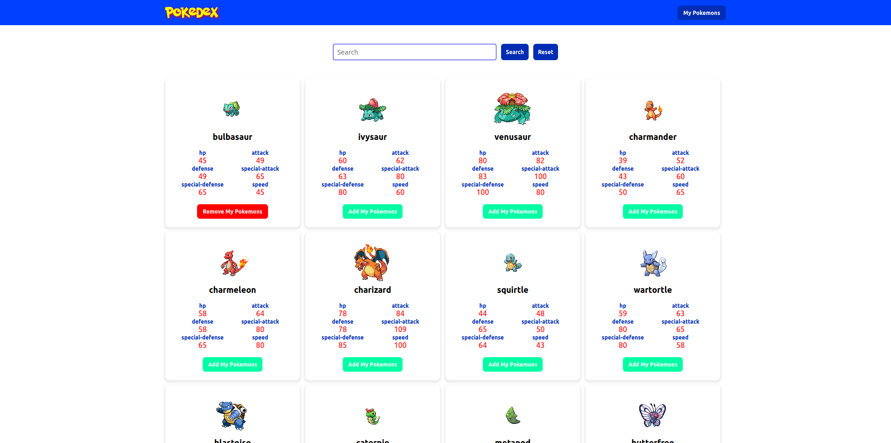
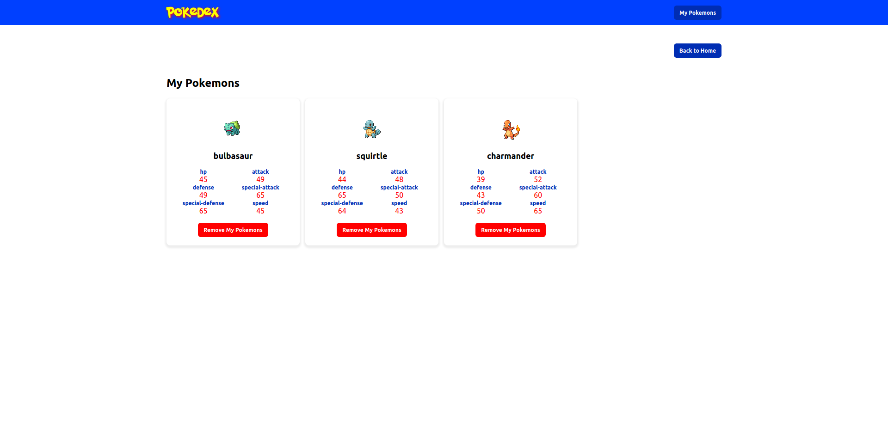
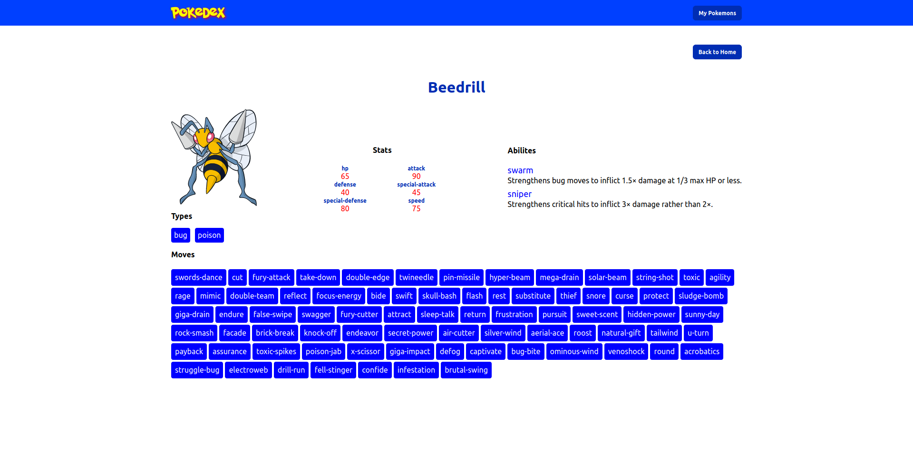

# Pokemon App
This project was done with React Hooks. I fetched data from [PokeApi](https://pokeapi.co/). I did it to learn useReducer and useContext Hooks 

## Feature
- Search Pokemon
- Browse through a list of all Pokémons.
- Check stats, moves, etc. for each Pokémon.
- Add or remove a Pokémon from "My Pokémons" list.
- Browse through his "My Pokémons" list
- Check the details of his "My Pokémons" list
- Paginate
- Responsive Design

## Screens




## Setup
```
git clone https://github.com/Cihatata/pokemonApp.git
cd pokemonApp
npm install
npm start
```
